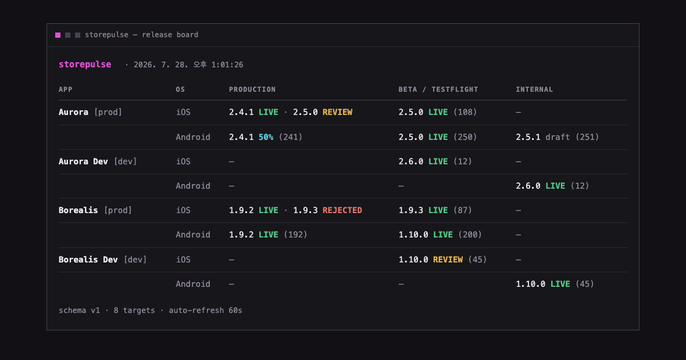

<!-- logo: docs/images/logo.png (coming soon) -->

# storepulse

**English** | [한국어](README.ko.md) | [日本語](README.ja.md) | [简体中文](README.zh-CN.md) | [繁體中文](README.zh-TW.md)

**One-glance release status for all your iOS & Android apps.**

🌐 **Website & tutorial → [diokr.github.io/storepulse](https://diokr.github.io/storepulse/)**

Which version is live? Which one is stuck in review? What's on TestFlight right
now? If answering that means clicking through App Store Connect *and* Google
Play Console app by app — storepulse is for you. One command, one board:


Built with **Expo / React Native** teams in mind, but it works for any
iOS/Android app — storepulse only talks to the stores, not to your build
system.

- 🔍 **Read-only.** It never changes anything in either store.
- 🔐 **Your credentials stay on your machine.** storepulse calls Apple and
  Google directly — there is no server, no account, no telemetry.
- 🧩 **Extensible.** The core is a library; the CLI is just its first consumer.

---

## Try it first — no credentials needed

You can see exactly what storepulse does in under a minute, using sample data.

**Prerequisites**: [Node.js](https://nodejs.org) ≥ 20.12 and
[pnpm](https://pnpm.io) ≥ 9.

```sh
git clone https://github.com/dioKR/storepulse.git
cd storepulse
pnpm install
pnpm demo
```

That's it — the board you see is fake data shaped like a real team: two apps,
each with a prod and a dev variant, on both platforms.

## How to read the board

Each row is one app on one platform. Each column is a **channel** — where a
version lives on its way to users:

| Column | iOS | Android |
|---|---|---|
| `PRODUCTION` | App Store | production track |
| `BETA / TESTFLIGHT` | TestFlight (external) | open/closed testing |
| `INTERNAL` | TestFlight (internal) | internal testing |

Inside a cell, every version is tagged with its **state**:

| Badge | Meaning |
|---|---|
| `2.4.1 LIVE` (green) | Fully released and available to users |
| `2.4.1 50%` (cyan) | Rolling out gradually — 50% of users have it |
| `2.5.0 REVIEW` (yellow) | Waiting for / in store review |
| `2.5.0 PENDING` (blue) | Approved or processing, not released yet |
| `1.9.3 REJECTED` (red) | Review rejected — needs your attention |
| `2.5.1 draft` (dim) | Prepared but not submitted |
| `(108)` (dim) | Build number / versionCode |

A cell can show more than one version — `2.4.1 LIVE · 2.5.0 REVIEW` means
2.4.1 is what users have while 2.5.0 waits for review. That in-between moment
is exactly what this tool exists to make visible.

## The same board — in a browser, or as JSON

The CLI board has two siblings. Both work in demo mode, no credentials needed:

```sh
npx storepulse serve --demo     # local web dashboard → http://127.0.0.1:4780
npx storepulse snapshot --demo  # the board as JSON, to stdout
```



- **`storepulse serve`** starts a local, auto-refreshing web dashboard — same
  board, same design. Options: `--port`, `--host`, `--refresh <seconds>`. It
  binds to `127.0.0.1` by default; the board may list unreleased version
  numbers, so think twice before exposing it.
- **`storepulse snapshot`** prints the board as JSON (`--out <file>` writes it
  to a file) — handy for CI artifacts or your own scripts. The document format
  is specified in [docs/snapshot-schema.md](docs/snapshot-schema.md).

Drop `--demo` and both commands use your real config, set up below.

---

## Connect your real apps

Three steps: list your apps → add credentials → run.

### Step 1 — List your apps

Copy the example config and edit it:

```sh
cp storepulse.config.example.json storepulse.config.json
```

```jsonc
{
  "apps": [
    { "key": "myapp-ios",     "name": "MyApp", "group": "prod",
      "platform": "ios",     "storeId": "1234567890" },
    { "key": "myapp-android", "name": "MyApp", "group": "prod",
      "platform": "android", "storeId": "com.example.myapp" }
  ]
}
```

| Field | What it is |
|---|---|
| `key` | Any unique name you like (used internally) |
| `name` | Display name shown on the board |
| `group` | Optional label shown next to the name — e.g. `prod` / `dev` |
| `platform` | `ios` or `android` |
| `storeId` | **iOS**: the numeric Apple ID of the app. **Android**: the package name |

**Where do I find the iOS numeric ID?** App Store Connect → your app →
**App Information** → General Information → **Apple ID** (a number like
`1234567890`):


### Step 2 — Add credentials

```sh
cp .env.example .env
```

Now fill in `.env`. You need one thing from Apple and one from Google — both
are one-time setups that take about five minutes each.

#### Apple — App Store Connect API key

1. Go to [App Store Connect](https://appstoreconnect.apple.com) →
   **Users and Access** → **Integrations** → **App Store Connect API**.
2. Under **Team Keys**, click **＋** to generate a key.
   Role: **Developer** is recommended — it covers everything storepulse
   reads. **App Manager** works too, but a leaked App Manager key can submit
   apps and edit metadata, so grant the least privilege you can.
3. **Download the `.p8` file** — Apple lets you download it exactly once.
   Store it somewhere safe (it's git-ignored here by default). This key can
   write as much as its role allows — if it ever leaks, revoke it
   immediately in App Store Connect.
4. Copy three values into `.env`:

```ini
ASC_KEY_ID=ABC123DEFG          # "Key ID" column of the key you created
ASC_ISSUER_ID=xxxxxxxx-...     # "Issuer ID" shown at the top of the page
ASC_PRIVATE_KEY_PATH=./AuthKey_ABC123DEFG.p8
```


#### Google — Play service account

1. In [Google Cloud Console](https://console.cloud.google.com), pick (or
   create) a project and enable the **Google Play Android Developer API**.
2. **IAM & Admin → Service Accounts** → create one (no special roles needed) →
   **Keys** tab → **Add key → JSON**. A JSON file downloads.
3. In [Play Console](https://play.google.com/console) →
   **Users and permissions** → **Invite new users** → paste the service
   account's email (`...@...iam.gserviceaccount.com`) → grant it access to
   your apps with **View app information** permission. Grant only that —
   **never** give the service account any Release/publish permissions;
   storepulse doesn't need them, and a leaked key stays read-only.
4. Point `.env` at the JSON:

```ini
PLAY_SERVICE_ACCOUNT_PATH=./service-account.json
```


> **CI tip**: both secrets also accept a `*_BASE64` variant
> (`ASC_PRIVATE_KEY_BASE64`, `PLAY_SERVICE_ACCOUNT_BASE64`) so you can store
> them as CI secrets without files.

### Step 3 — Run

```sh
pnpm status
```

Your real board appears. Rows with credential problems show an inline error
instead of hiding the rest of the board.

---

## Troubleshooting

| Symptom | Likely cause |
|---|---|
| `ASC API 401` | Wrong Key ID / Issuer ID, or the `.p8` doesn't match the Key ID |
| `ASC API 404` | The `storeId` isn't the *numeric* Apple ID, or the key's role can't see that app |
| `Play API 403` | Service account not invited in Play Console, or the Android Developer API isn't enabled in your Cloud project |
| `Play API 404` | Package name typo, or the app has never had a release |
| Android shows no review state | Not a bug — Google's API doesn't expose review status ([details](wiki/Architecture.md)) |

## Architecture

`@storepulse/core` normalizes both stores into one model
(channel × state) behind a two-method `StoreConnector` interface; the CLI is
just its first consumer. Read the full picture — diagrams included — in
[**wiki/Architecture**](wiki/Architecture.md).

## Development

```sh
pnpm demo        # board with sample data
pnpm status      # board with your real config
pnpm typecheck   # tsc across all packages
pnpm test        # unit tests (vitest)
pnpm lint        # Biome (lint + format check)
pnpm lint:fix    # auto-fix
```

Formatting and linting are handled by [Biome](https://biomejs.dev) — one tool
replacing ESLint + Prettier. Editor setup: install the Biome extension and it
picks up `biome.json` automatically.

## Roadmap

- [ ] EAS connector — link store status to Expo builds & submissions
- [ ] Slack/Discord notifications on state changes ("2.5.0 approved 🎉")
- [x] Web dashboard (`storepulse serve`)
- [x] Publish to npm (`npx storepulse`)
- [ ] CLI output in English & Korean

## License

[MIT](LICENSE)
