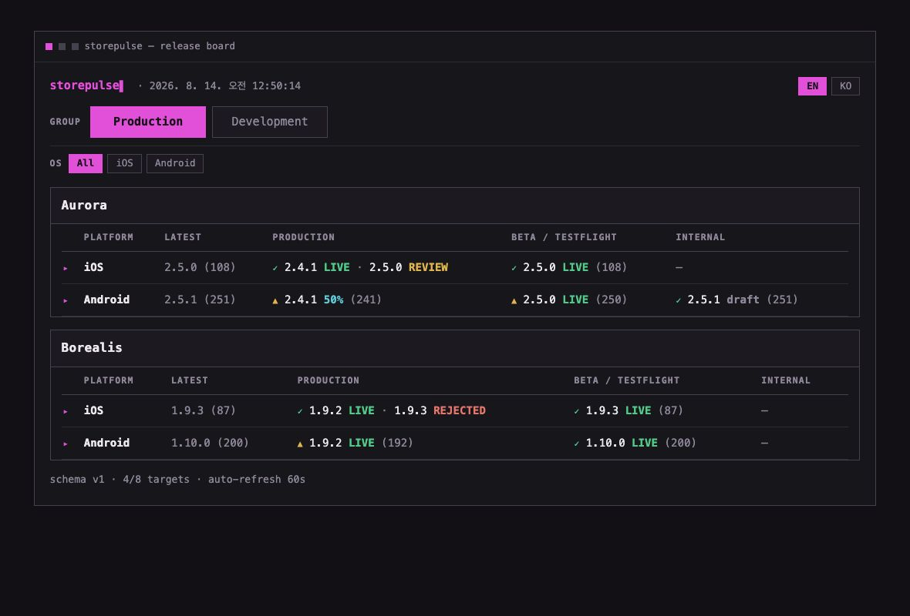
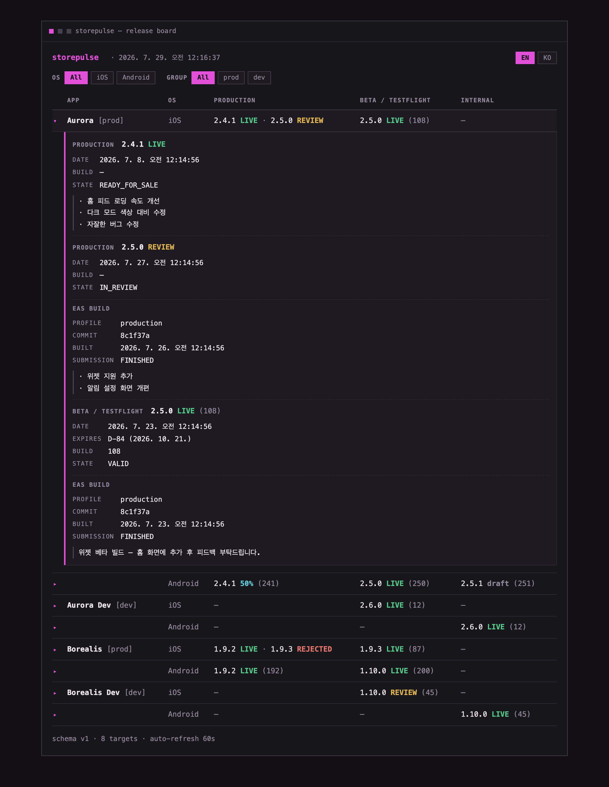

<!-- logo: docs/images/logo.png (coming soon) -->

# storepulse

**English** | [한국어](README.ko.md) | [日本語](README.ja.md) | [简体中文](README.zh-CN.md) | [繁體中文](README.zh-TW.md)

**One-glance release status for all your iOS & Android apps.**

🌐 **Website & tutorial → [diokr.github.io/storepulse](https://diokr.github.io/storepulse/)**

Which version is live? Which one is stuck in review? What's on TestFlight right
now? If answering that means clicking through App Store Connect *and* Google
Play Console app by app — storepulse is for you. One command, one board:


Try it right now — no credentials, no config, no clone. All you need is
[Node.js](https://nodejs.org) ≥ 20.12:

```sh
npx storepulse demo           # the release board, in your terminal
npx storepulse serve --demo   # the same board as a local web dashboard → http://127.0.0.1:4780
```

The board you see is fake data shaped like a real team: two apps, each with a
prod and a dev variant, on both platforms.

Built with **Expo / React Native** teams in mind, but it works for any
iOS/Android app — storepulse only talks to the stores, not to your build
system.

- 🔍 **Read-only.** It never changes anything in either store.
- 🔐 **Your credentials stay on your machine.** storepulse calls Apple and
  Google directly — there is no server, no account, no telemetry.
- 🧩 **Extensible.** The core is a library; the CLI is just its first consumer.

---

## Is storepulse for you?

storepulse is **local, read-only, post-submit release observability for small
Expo / React Native teams** — it watches what happens to your releases *after*
you hit submit, and nothing more.

**A good fit if you want to:**

- see live versions, review states, rollout percentages, and test tracks for
  every app on one board — terminal, browser, or JSON in CI
- keep store credentials on your own machine — no account, no hosted server,
  no telemetry

**Not what you're looking for if you need:**

- to submit, promote, or roll out releases — storepulse never writes to
  either store
- ASO, review/rating analytics, or revenue dashboards
- a hosted SaaS — storepulse runs where you run it

## How to read the board

Each row is one app on one platform. Each column is a **channel** — where a
version lives on its way to users:

| Column | iOS | Android |
|---|---|---|
| `PRODUCTION` | App Store | production track |
| `BETA / TESTFLIGHT` | TestFlight (external) | open/closed testing |
| `INTERNAL` | TestFlight (internal) | internal testing |

Inside a cell, every version is tagged with its **state**:

| Badge | Meaning |
|---|---|
| `2.4.1 LIVE` (green) | Fully released and available to users |
| `2.4.1 50%` (cyan) | Rolling out gradually — 50% of users have it |
| `2.5.0 REVIEW` (yellow) | Waiting for / in store review |
| `2.5.0 PENDING` (blue) | Approved or processing, not released yet |
| `1.9.3 REJECTED` (red) | Review rejected — needs your attention |
| `2.5.1 draft` (dim) | Prepared but not submitted |
| `(108)` (dim) | Build number / versionCode |

A cell can show more than one version — `2.4.1 LIVE · 2.5.0 REVIEW` means
2.4.1 is what users have while 2.5.0 waits for review. That in-between moment
is exactly what this tool exists to make visible.

Forget what a badge means? The legend is built into the CLI:

```sh
npx storepulse explain            # every state at a glance
npx storepulse explain rejected   # one state in depth — meaning, raw store states, what to do
```

All CLI messages, errors, and help are available in English and Korean — pick
with `--lang ko|en` or `STOREPULSE_LANG`, or let it follow your OS locale
(badges and column headers stay in English either way).

## The same board — in a browser, or as JSON

The CLI board has two siblings. Both work in demo mode, no credentials needed:

```sh
npx storepulse serve --demo     # local web dashboard → http://127.0.0.1:4780
npx storepulse snapshot --demo  # the board as JSON, to stdout
```



- **`storepulse serve`** starts a local, auto-refreshing web dashboard — same
  board, same design. Click any row to open a detail panel: full release
  notes, submission/upload dates, and a TestFlight expiry countdown that
  turns into a warning at D-7. The chips at the top filter the board by OS
  (iOS/Android) and by group (e.g. `prod` / `dev`), combined together.
  Each row also sums up its latest uploaded bundle (`Latest: 2.5.0 (108)`),
  and every channel that has a release carries a propagation mark — ✓ when it already has that
  bundle, ▲ when it lags behind (hover to compare current vs latest; Android
  compares by versionCode) — so "how far did the newest build travel?" is
  answered at a glance.
  The EN/KO switcher in the header flips the dashboard between English and
  Korean (your browser remembers the choice), and clicking a state badge —
  as opposed to the row — opens a glossary dialog explaining that state.
  Options: `--port`, `--host`, `--refresh <seconds>`. It
  binds to `127.0.0.1` by default; the board may list unreleased version
  numbers, so think twice before exposing it.
- **`storepulse snapshot`** prints the board as JSON (`--out <file>` writes it
  to a file) — handy for CI artifacts or your own scripts. The document format
  is specified in [docs/snapshot-schema.md](docs/snapshot-schema.md).


Drop `--demo` and both commands use your real config, set up below.

Want the board online for your whole team? The **[deployment guides](docs/deploy/README.md)** cover AWS, Cloudflare, Vercel, Netlify, and Google Cloud — with scheduled snapshot refresh and access control built in.

## Turn release states into a CI gate

`storepulse check` collects the same store data and fails CI when any channel
matches the states in `--fail-on`:

```sh
npx storepulse check --fail-on rejected,halted
npx storepulse check --fail-on rejected,halted --format json
```

The supported states are `live`, `rollout`, `in-review`, `pending`, `rejected`,
`halted`, `draft`, and `unknown`. The exit code is `0` when collection succeeds
with no match, `1` when the policy finds a match, and `2` for invalid arguments
or a collection error. That distinction lets CI report a policy violation
separately from a credential, config, or store API failure. Add `--demo` to try
the policy without credentials.

---

## Connect your real apps

Three steps: list your apps → add credentials → run.

### Step 1 — List your apps

Scaffold the config first — in any folder, no repo clone needed:

```sh
npx storepulse init
```

It creates `storepulse.config.json` and a `.env` template (existing files are
never overwritten), adds the credential files to `.gitignore` so they can't be
committed, and prints your next steps (English or Korean, `--lang ko|en`).
(Working in a clone of this repo instead? `cp storepulse.config.example.json
storepulse.config.json` gives you the same file.)

Now open `storepulse.config.json` and describe your apps:

```jsonc
{
  "apps": [
    { "key": "myapp-ios",     "name": "MyApp", "group": "prod",
      "platform": "ios",     "storeId": "1234567890" },
    { "key": "myapp-android", "name": "MyApp", "group": "prod",
      "platform": "android", "storeId": "com.example.myapp" }
  ]
}
```

| Field | What it is |
|---|---|
| `key` | Any unique name you like (used internally) |
| `name` | Display name shown on the board |
| `group` | Optional label shown next to the name — e.g. `prod` / `dev` |
| `platform` | `ios` or `android` |
| `storeId` | **iOS**: the numeric Apple ID of the app. **Android**: the package name |

**Where do I find the iOS numeric ID?** App Store Connect → your app →
**App Information** → General Information → **Apple ID** (a number like
`1234567890`).

### Step 2 — Add credentials

Now fill in the `.env` that `storepulse init` created (in a repo clone:
`cp .env.example .env`). You need one thing from Apple and one from Google —
both are one-time setups that take about five minutes each.

#### Apple — App Store Connect API key

1. Go to [App Store Connect](https://appstoreconnect.apple.com) →
   **Users and Access** → **Integrations** → **App Store Connect API**.
2. Under **Team Keys**, click **＋** to generate a key.
   Role: **Developer** is recommended — it covers everything storepulse
   reads. **App Manager** works too, but a leaked App Manager key can submit
   apps and edit metadata, so grant the least privilege you can.
3. **Download the `.p8` file** — Apple lets you download it exactly once.
   Store it somewhere safe (`storepulse init` already git-ignores it). This key can
   write as much as its role allows — if it ever leaks, revoke it
   immediately in App Store Connect.
4. Copy three values into `.env`:

```ini
ASC_KEY_ID=ABC123DEFG          # "Key ID" column of the key you created
ASC_ISSUER_ID=xxxxxxxx-...     # "Issuer ID" shown at the top of the page
ASC_PRIVATE_KEY_PATH=./AuthKey_ABC123DEFG.p8
```

Console menus move around from time to time — if they have, follow Apple's
official guide: [Creating API Keys for App Store Connect API](https://developer.apple.com/documentation/appstoreconnectapi/creating-api-keys-for-app-store-connect-api).

#### Google — Play service account

1. In [Google Cloud Console](https://console.cloud.google.com), pick (or
   create) a project and enable the **Google Play Android Developer API**.
2. **IAM & Admin → Service Accounts** → create one (no special roles needed) →
   **Keys** tab → **Add key → JSON**. A JSON file downloads.
3. In [Play Console](https://play.google.com/console) →
   **Users and permissions** → **Invite new users** → paste the service
   account's email (`...@...iam.gserviceaccount.com`) → grant it access to
   your apps with **View app information** permission. Grant only that —
   **never** give the service account any Release/publish permissions;
   storepulse doesn't need them, and a leaked key stays read-only.
4. Point `.env` at the JSON:

```ini
PLAY_SERVICE_ACCOUNT_PATH=./service-account.json
```

If the console layout has changed, Google's official guide covers the same
steps: [Getting started with the Google Play Developer API](https://developers.google.com/android-publisher/getting_started).

> **CI tip**: both secrets also accept a `*_BASE64` variant
> (`ASC_PRIVATE_KEY_BASE64`, `PLAY_SERVICE_ACCOUNT_BASE64`) so you can store
> them as CI secrets without files.

Everything filled in? Before the first real run you can optionally run
`npx storepulse doctor` — it verifies the credentials you just entered,
step by step, against both stores.

### Step 3 — Run

```sh
npx storepulse
```

Your real board appears (in a repo clone, `pnpm status` does the same). Rows
with credential problems show an inline error instead of hiding the rest of
the board.

### Optional — link Expo (EAS) builds

Ship with Expo? Two small additions connect every store version to the EAS
build that produced it. Add an access token to `.env` (create one under
[expo.dev → Access tokens](https://expo.dev/settings/access-tokens); for
organizations, prefer a **View Only** robot token — storepulse only reads
builds and submissions, never triggers them):

```ini
EAS_TOKEN=...
```

Then give each Expo app in `storepulse.config.json` its `easProjectId`
(`app.json` → `extra.eas.projectId`; the ios and android entries of one app
share the same value):

```jsonc
{ "key": "myapp-ios", "platform": "ios", "storeId": "1234567890",
  "easProjectId": "5b2fb1e0-6c2a-4b8e-9d3f-4a1c2e8f7a90" }
```

That's it — `snapshot` and the web dashboard now enrich each version
with the EAS build behind it: git commit, build profile, and submission
status (the terminal board keeps its one-line summary on purpose).
The dashboard detail panel gets an **EAS BUILD** block, and
`npx storepulse doctor` verifies the whole chain in its `[5] Expo (EAS)`
section. The snapshot grows optional `eas` / `easProjectId` /
`easAppIdentifier` fields only — `schemaVersion` stays 1
([details](docs/snapshot-schema.md)). If one EAS project builds several
variants of a platform, scope the matching with `easAppIdentifier`
(Android defaults to the `storeId`).



---

## Troubleshooting

First, run `npx storepulse doctor` — it diagnoses most of the causes below
automatically, with a one-line fix for each.

| Symptom | Likely cause |
|---|---|
| `ASC API 401` | Wrong Key ID / Issuer ID, or the `.p8` doesn't match the Key ID |
| `ASC API 404` | The `storeId` isn't the *numeric* Apple ID, or the key's role can't see that app |
| `Play API 403` | Service account not invited in Play Console, or the Android Developer API isn't enabled in your Cloud project |
| `Play API 404` | Package name typo, or the app has never had a release |
| Android shows no review state | Not a bug — Google's API doesn't expose review status ([details](wiki/Architecture.md)) |

## Architecture

`@storepulse/core` normalizes both stores into one model
(channel × state) behind a two-method `StoreConnector` interface; the CLI is
just its first consumer. Read the full picture — diagrams included — in
[**wiki/Architecture**](wiki/Architecture.md).

## Development

Working on storepulse itself? Clone the repo — this is the only flow that
needs [pnpm](https://pnpm.io) ≥ 9:

```sh
git clone https://github.com/dioKR/storepulse.git
cd storepulse
pnpm install
```

```sh
pnpm demo              # board with sample data
pnpm status            # board with your real config
npx storepulse init    # scaffold storepulse.config.json + .env templates (any folder)
npx storepulse doctor  # diagnose credentials & permissions (find the 401/403)
pnpm typecheck         # tsc across all packages
pnpm test              # unit tests (vitest)
pnpm lint              # Biome (lint + format check)
pnpm lint:fix          # auto-fix
```

Formatting and linting are handled by [Biome](https://biomejs.dev) — one tool
replacing ESLint + Prettier. Editor setup: install the Biome extension and it
picks up `biome.json` automatically.

## Roadmap

Done so far:

- [x] EAS connector — link store status to Expo builds & submissions
- [x] Web dashboard (`storepulse serve`)
- [x] Publish to npm (`npx storepulse`)
- [x] CLI output in English & Korean (`--lang ko`, `storepulse explain`)
- [x] Snapshot diff engine (`storepulse diff`)
- [x] CI policy gate (`storepulse check --fail-on`)

Up next ([full roadmap](https://github.com/dioKR/storepulse/issues/57)):

- [ ] Official GitHub Action for scheduled checks and Job Summary
- [ ] Generic webhook events on release changes — point Slack, Discord, or
  your own automation at them
- [ ] Local watch mode

## License

[MIT](LICENSE)
