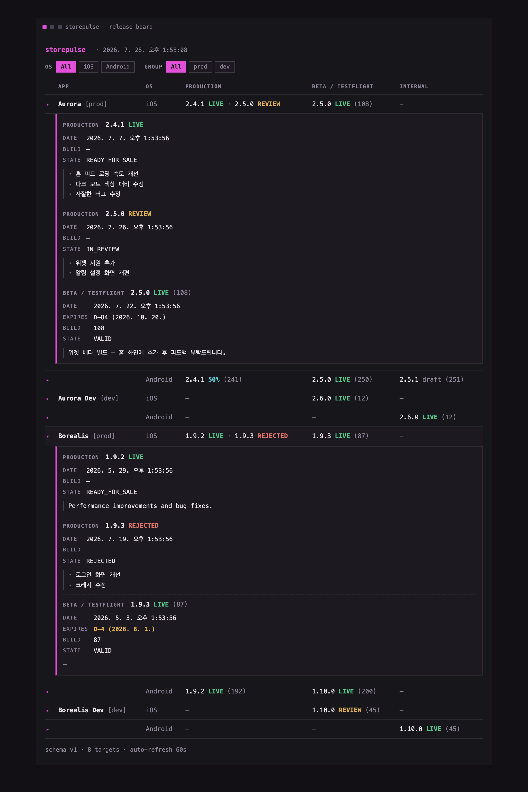
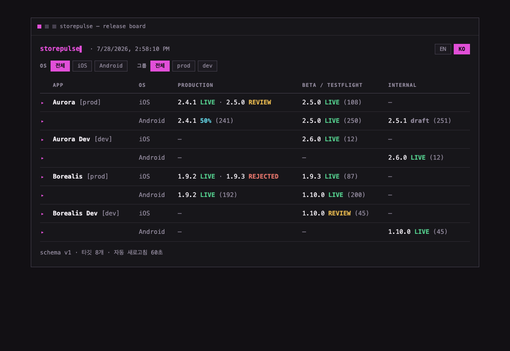

<!-- logo: docs/images/logo.png (即将推出) -->

# storepulse

[English](README.md) | [한국어](README.ko.md) | [日本語](README.ja.md) | **简体中文** | [繁體中文](README.zh-TW.md)

**所有 iOS · Android 应用的发布状态,一目了然。**

🌐 **网站 & 教程 → [diokr.github.io/storepulse](https://diokr.github.io/storepulse/zh-cn/)**

现在线上是哪个版本?哪个版本卡在审核?TestFlight 上现在跑的是什么?——
如果确认这些事还得在 App Store Connect 和 Google Play Console 里一个应用一个
应用地点,storepulse 就是为你准备的。一条命令,一块看板:



它是为 **Expo / React Native** 团队优先设计的,但任何 iOS/Android 应用都能用
—— storepulse 只跟商店打交道,不碰你的构建系统。

- 🔍 **只读。** 不会改动两家商店里的任何东西。
- 🔐 **凭据不离开你的电脑。** storepulse 直接调用 Apple 和 Google ——
  没有服务器,没有账号,没有遥测。
- 🧩 **易于扩展。** 核心是一个库,CLI 只是它的第一个消费者。

---

## 先试试看 —— 不需要凭据

用示例数据,一分钟内就能看到 storepulse 到底做什么。

**前置要求**:[Node.js](https://nodejs.org) ≥ 20.12,
[pnpm](https://pnpm.io) ≥ 9。

```sh
git clone https://github.com/dioKR/storepulse.git
cd storepulse
pnpm install
pnpm demo
```

就这样 —— 你看到的看板是模拟真实团队的假数据:两个应用,各有 prod·dev
两个变体,覆盖双平台。

## 怎么看这块看板

每一行是"一个应用的一个平台"。每一列是一个**渠道** ——
版本在抵达用户之前所处的位置:

| 列 | iOS | Android |
|---|---|---|
| `PRODUCTION` | App Store | production 轨道 |
| `BETA / TESTFLIGHT` | TestFlight(外部) | 开放/封闭测试 |
| `INTERNAL` | TestFlight(内部) | 内部测试 |

单元格里的每个版本都带着**状态**徽标:

| 徽标 | 含义 |
|---|---|
| `2.4.1 LIVE`(绿) | 已全量发布,用户可用 |
| `2.4.1 50%`(青) | 灰度发布中 —— 50% 的用户已拿到 |
| `2.5.0 REVIEW`(黄) | 等待/正在商店审核 |
| `2.5.0 PENDING`(蓝) | 已批准或处理中,尚未发布 |
| `1.9.3 REJECTED`(红) | 审核被拒 —— 需要你处理 |
| `2.5.1 draft`(暗) | 已准备但未提交 |
| `(108)`(暗) | 构建号 / versionCode |

一个单元格里可能有多个版本 —— `2.4.1 LIVE · 2.5.0 REVIEW` 的意思是
"用户在用 2.4.1,而 2.5.0 正在等审核"。让这个"中间时刻"变得可见,
正是这个工具存在的意义。

忘了徽标是什么意思?图例就内置在 CLI 里:

```sh
npx storepulse explain            # 一览所有状态
npx storepulse explain rejected   # 深入一个状态 —— 含义、商店原始状态、建议操作
```

CLI 的提示、错误和帮助文本支持英文和韩文 —— 用 `--lang ko|en` 或
`STOREPULSE_LANG` 选择,未指定时跟随操作系统区域设置(徽标和列标题
在两种语言下都保持英文)。

## 同一块看板,放进浏览器,或导出成 JSON

CLI 看板还有两条兄弟命令。都支持演示模式,不需要凭据:

```sh
npx storepulse serve --demo     # 本地 Web 看板 → http://127.0.0.1:4780
npx storepulse snapshot --demo  # 把看板输出成 JSON
```



- **`storepulse serve`** 启动一个本地 Web 看板 —— 同一块看板,同样的设计,
  还会自动刷新。点击任意一行即可展开详情面板:发布说明全文、提交/上传日期,
  TestFlight 剩余有效期不足 7 天时还会亮出倒计时警告。顶部的筛选标签可以按
  OS(iOS/Android)和分组(`prod`/`dev`)组合过滤看板。顶栏的 EN/KO
  切换器可以切换看板语言(选择会记在浏览器里),点击状态徽标(而不是整行)
  会弹出解释该状态含义的术语对话框。选项:`--port`、
  `--host`、`--refresh <秒>`。默认只绑定
  `127.0.0.1` —— 看板上可能出现尚未发布的版本号,对外开放前请三思。
- **`storepulse snapshot`** 把看板输出成 JSON(`--out <文件>` 可写入文件)
  —— 适合 CI 产物或你自己的脚本。文档格式见
  [docs/snapshot-schema.md](docs/snapshot-schema.md)。




去掉 `--demo`,两条命令就会使用下文配置的真实应用。

想让整个团队在线看这块看板?**[部署指南](docs/deploy/README.md)** 覆盖 AWS、Cloudflare、Vercel、Netlify 和 Google Cloud —— 内置快照定时刷新与访问控制。

---

## 接入你的真实应用

三步:列出应用 → 填入凭据 → 运行。

### 第 1 步 —— 列出应用

先生成配置文件 —— 不必克隆仓库,在任意文件夹里都行:

```sh
npx storepulse init
```

这条命令会创建 `storepulse.config.json` 和 `.env` 模板(已有的文件绝不会被
覆盖),并把凭据文件加进 `.gitignore` 以免误提交,随后在终端里打印后续步骤
(`--lang ko|en`)。(在本仓库的克隆里工作?`cp storepulse.config.example.json
storepulse.config.json` 也能得到同一份文件。)

接着打开 `storepulse.config.json`,列出你的应用:

```jsonc
{
  "apps": [
    { "key": "myapp-ios",     "name": "MyApp", "group": "prod",
      "platform": "ios",     "storeId": "1234567890" },
    { "key": "myapp-android", "name": "MyApp", "group": "prod",
      "platform": "android", "storeId": "com.example.myapp" }
  ]
}
```

| 字段 | 说明 |
|---|---|
| `key` | 内部标识,不重复即可 |
| `name` | 看板上显示的名称 |
| `group` | 名称旁的标签(可选)—— 如 `prod` / `dev` |
| `platform` | `ios` 或 `android` |
| `storeId` | **iOS**:应用的数字 Apple ID · **Android**:包名 |

**iOS 的数字 ID 在哪找?** App Store Connect → 你的应用 →
**App 信息(App Information)** → 通用信息 → **Apple ID**(形如
`1234567890` 的数字)。

### 第 2 步 —— 填入凭据

现在填 `storepulse init` 生成的 `.env`(仓库克隆里则用
`cp .env.example .env`)。Apple 要一样,Google 要一样 —— 各花 5 分钟左右,
都是一次性配置。

#### Apple —— App Store Connect API 密钥

1. 打开 [App Store Connect](https://appstoreconnect.apple.com) →
   **用户和访问(Users and Access)** → **集成(Integrations)** →
   **App Store Connect API**。
2. 在**团队密钥(Team Keys)**下点 **＋** 生成密钥。
   角色建议选 **Developer** —— 对 storepulse 的读取来说已经足够。
   **App Manager** 也能用,但密钥一旦泄露,提交应用、改动元数据的权限
   也会一并流出,按最小权限原则来更稳妥。
3. **下载 `.p8` 文件** —— Apple 只允许下载一次。
   请妥善保管(`storepulse init` 已把它加入 git 忽略)。这把密钥能在其角色允许的范围内
   执行写操作,一旦泄露,请立即到 App Store Connect 吊销(revoke)。
4. 把三个值复制进 `.env`:

```ini
ASC_KEY_ID=ABC123DEFG          # 你创建的密钥的 "Key ID" 列
ASC_ISSUER_ID=xxxxxxxx-...     # 页面顶部的 "Issuer ID"
ASC_PRIVATE_KEY_PATH=./AuthKey_ABC123DEFG.p8
```

控制台界面时常变动 —— 如果菜单位置对不上,请按照 Apple 官方指南
[Creating API Keys for App Store Connect API](https://developer.apple.com/documentation/appstoreconnectapi/creating-api-keys-for-app-store-connect-api) 操作。

#### Google —— Play 服务账号

1. 在 [Google Cloud Console](https://console.cloud.google.com) 选择(或创建)
   一个项目,启用 **Google Play Android Developer API**。
2. **IAM 和管理 → 服务账号** → 创建一个(无需特殊角色)→
   **密钥**标签页 → **添加密钥 → JSON**,浏览器会下载一个 JSON 文件。
3. 打开 [Play Console](https://play.google.com/console) →
   **用户和权限** → **邀请新用户** → 粘贴服务账号邮箱
   (`...@...iam.gserviceaccount.com`)→ 为你的应用授予
   **查看应用信息(View app information)**权限。只授予这一项 ——
   **千万不要授予任何发布(Release)权限**;storepulse 用不到,
   这样即使密钥泄露也只停留在只读。
4. 让 `.env` 指向该 JSON:

```ini
PLAY_SERVICE_ACCOUNT_PATH=./service-account.json
```

如果控制台布局有变,Google 官方的
[Google Play Developer API 入门指南](https://developers.google.com/android-publisher/getting_started)覆盖了同样的步骤。

> **CI 提示**:两个密钥都支持 `*_BASE64` 形式(`ASC_PRIVATE_KEY_BASE64`、
> `PLAY_SERVICE_ACCOUNT_BASE64`),可以直接存成 CI 密钥,不用落盘。

都填好了?正式运行前,还可以先用 `npx storepulse doctor` 逐步检查一遍
刚填入的凭据在两家商店是否有效(可选)。

### 第 3 步 —— 运行

```sh
npx storepulse
```

你的真实看板就出现了(在仓库克隆里,`pnpm status` 效果相同)。
凭据有问题的行只在原地显示错误,不会遮住看板的其余部分。

---

## 问题排查

先运行 `npx storepulse doctor` —— 下面这些原因,它大多能自动诊断出来,
每个失败项还会给出一行解决办法。

| 症状 | 大概率的原因 |
|---|---|
| `ASC API 401` | Key ID / Issuer ID 填错,或 `.p8` 与该 Key ID 不匹配 |
| `ASC API 404` | `storeId` 不是*数字* Apple ID,或密钥的角色看不到这个应用 |
| `Play API 403` | 服务账号没被邀请进 Play Console,或 Cloud 项目里的 Android Developer API 未启用 |
| `Play API 404` | 包名拼写错误,或该应用从未发布过 |
| Android 看不到审核状态 | 不是 bug —— Google 的 API 不提供审核状态([详情](wiki/Architecture.md)) |

## 架构

`@storepulse/core` 把两家商店归一化成同一个模型(渠道 × 状态),藏在只有
两个方法的 `StoreConnector` 接口后面;CLI 只是它的第一个消费者。
完整的架构图和说明见 [**wiki/Architecture**](wiki/Architecture.md)。

## 开发

```sh
pnpm demo              # 用示例数据显示看板
pnpm status            # 用真实配置显示看板
npx storepulse init    # 生成配置 + .env 模板(任意文件夹均可)
npx storepulse doctor  # 诊断凭据与权限(找出 401/403 的原因)
pnpm typecheck         # 对全部包运行 tsc
pnpm test              # 单元测试(vitest)
pnpm lint              # Biome(lint + 格式检查)
pnpm lint:fix          # 自动修复
```

格式化和 lint 由 [Biome](https://biomejs.dev) 一个工具搞定 —— 它替代了
ESLint + Prettier。编辑器装上 Biome 插件,就会自动读取 `biome.json`。

## 路线图

- [ ] EAS 连接器 —— 把商店状态和 Expo 的构建·提交关联起来
- [ ] 状态变化时的 Slack/Discord 通知("2.5.0 审核通过 🎉")
- [x] Web 看板(`storepulse serve`)
- [x] 发布到 npm(`npx storepulse`)
- [x] CLI 输出支持英文·韩文(`--lang ko`、`storepulse explain`)

## 许可证

[MIT](LICENSE)
