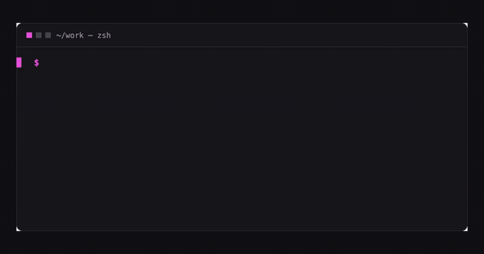

# External validation kit

This kit supports issue [#56](https://github.com/dioKR/storepulse/issues/56):
find the first five external developers or teams who will try storepulse, then
use their friction and requests to choose the next feature.

The goal is learning, not launch-day traffic or stars.

## Shareable assets

- [`../images/launch-demo.gif`](../images/launch-demo.gif) — 10.3-second
  CLI-to-web demo, 960×504, 361 KB. It contains sample data only.
- One-command demo: `npx storepulse demo`
- Browser demo: `npx storepulse serve --demo`
- Site: <https://diokr.github.io/storepulse/>
- Source: <https://github.com/dioKR/storepulse>

## Message facts

Keep every post factual and adapt it to the community instead of reposting the
same copy everywhere.

- Problem: after EAS Submit, the actual App Store Connect and Google Play
  release states still live in separate consoles.
- Product: one local, read-only board for iOS and Android release status.
- Trust boundary: no account, hosted server, or telemetry; store credentials
  stay in the user's environment.
- Fastest trial: `npx storepulse demo`, with no clone or credentials.
- Best audience: small Expo or React Native teams managing multiple apps,
  environments, or store tracks.
- Non-goals: submitting releases, controlling rollout, ASO, reviews, or sales
  analytics.

## English starting draft

> After an EAS Submit, I was still reopening App Store Connect and Play Console
> to answer the same questions: what is live, what is in review, and which build
> reached each track?
>
> I built storepulse, an open-source, read-only CLI and local web dashboard that
> puts those states on one board. It has no account, hosted server, or telemetry,
> and store credentials stay in your environment.
>
> You can try the full demo without credentials:
>
> `npx storepulse demo`
>
> I am looking for a few Expo/React Native teams willing to try it. Where does
> the first run become unclear, would this replace any part of your current
> workflow, and what automation would matter first?

## 한국어 시작 초안

> EAS Submit을 마친 뒤에도 “지금 실제로 출시된 버전이 무엇인지, 무엇이 심사
> 중인지, 어느 빌드가 어느 트랙까지 갔는지” 확인하려고 App Store Connect와
> Play Console을 계속 번갈아 열고 있었습니다.
>
> 그래서 두 스토어의 상태를 하나의 읽기 전용 보드로 모아 보여주는 오픈소스
> CLI와 로컬 웹 대시보드 storepulse를 만들었습니다. 계정·호스팅 서버·텔레메트리가
> 없고 스토어 크리덴셜은 사용자의 환경 밖으로 나가지 않습니다.
>
> 크리덴셜 없이 전체 데모를 바로 실행할 수 있습니다:
>
> `npx storepulse demo`
>
> 직접 시험해볼 Expo/React Native 팀을 찾고 있습니다. 첫 실행에서 막힌 곳,
> 기존 방식 대신 계속 쓸 이유가 있는지, 가장 먼저 필요한 자동화가 무엇인지
> 알려주시면 다음 우선순위에 반영하겠습니다.

## Channel checklist

### Expo Community Discord

- Re-read the server's current channel rules before posting.
- Use the project showcase or similarly designated channel, not a help channel.
- Lead with the post-submit problem and the runnable demo, not a feature list.
- Follow the [Expo Community Guidelines](https://expo.dev/community-guidelines)
  and avoid repeated or automated promotion.

### r/expo and other Reddit communities

- Read the current subreddit sidebar and self-promotion rules immediately before
  posting; rules can differ by subreddit and change over time.
- Disclose that you made the project.
- Prefer one problem-focused post with the GIF and runnable command.
- Do not cross-post identical copy to several communities at once.

### Show HN

- Suggested title shape: `Show HN: Storepulse – a local release-status board for both app stores`.
- Link to the repository so readers can immediately run the project without a
  signup or email gate.
- Explain the personal problem, technical boundary, and what kind of feedback is
  useful. Do not frame a routine version update as the story.
- Read the current [Show HN Guidelines](https://news.ycombinator.com/showhn.html)
  and [Hacker News Guidelines](https://news.ycombinator.com/newsguidelines.html)
  before submitting. Hacker News currently says not to post generated or
  AI-edited text, so write the final submission yourself in your own voice; use
  the facts above only as a checklist.
- Never ask for upvotes or coordinated comments.

## Three interview questions

1. Where did you get stuck before seeing the first demo or real board?
2. What would make this worth keeping instead of your current workflow?
3. Which automation should come first: deployment, scheduled CI, policy checks,
   change notifications, or something else?

Ask one follow-up: “What do you do today?” A requested feature is more useful
when it is tied to an existing workflow and cost.

## Measurement sheet

Keep this outside the public repository. Do not record credentials, app IDs,
company-confidential data, or personal details that are not needed for product
decisions.

| anonymous participant | channel | demo attempted | real app attempted | time to demo | time to real board | blocker | keep using? | first automation request |
|---|---|---:|---:|---:|---:|---|---|---|
| P01 |  |  |  |  |  |  |  |  |

## Decision rule after five attempts

- Group repeated blockers; do not create more than three follow-up issues.
- Fix a first-run blocker before adding a new automation feature.
- If deployment is the repeated blocker, continue with #46.
- If scheduled inspection is the repeated need, prioritize #54.
- If team-channel notification is the repeated need, refine #55 and define a
  separate Slack adapter using the versioned generic event.
- Record failed trials as evidence too; stars and clone counts are not success
  metrics.
