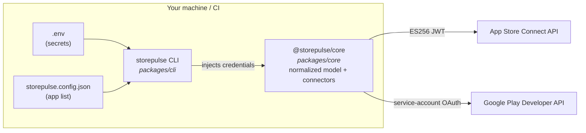
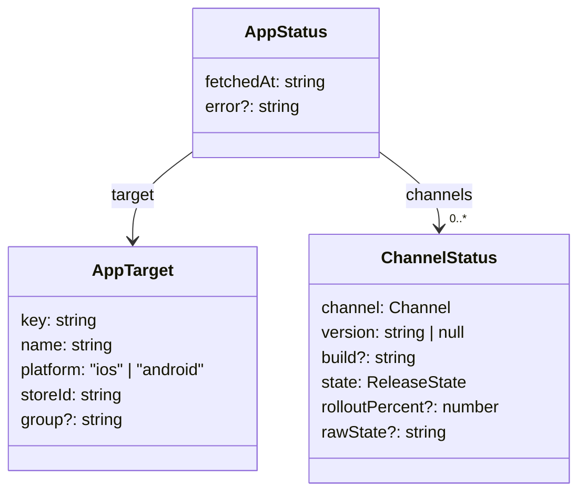
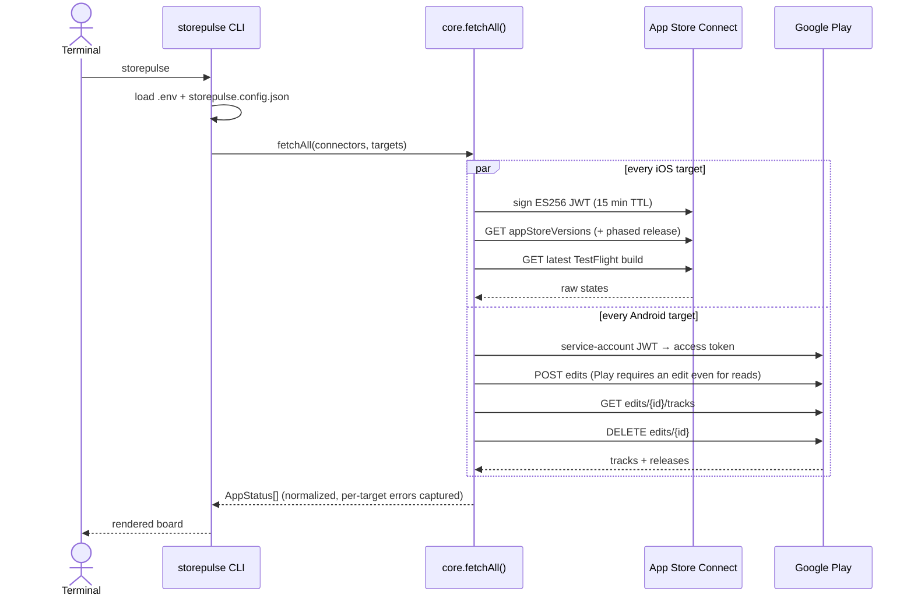
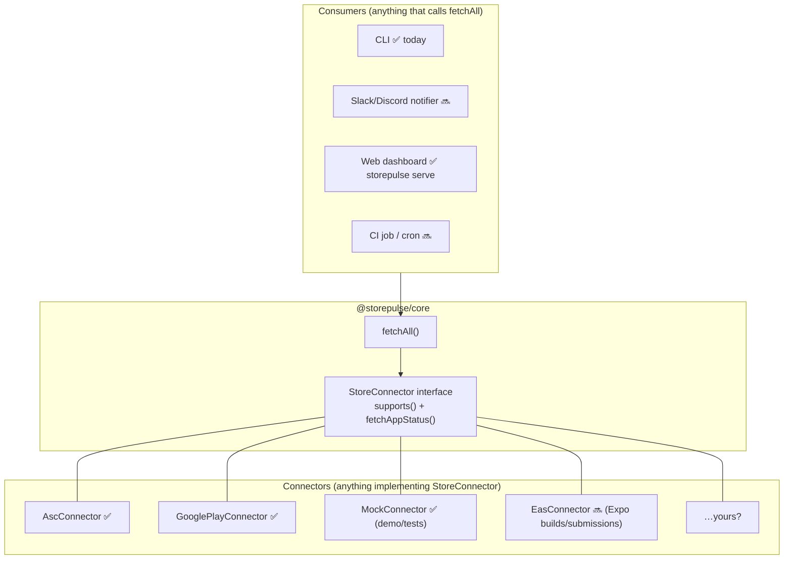

# Architecture

storepulse is a **read-only status aggregator**: it asks Apple and Google what
state your releases are in, normalizes both answers into one model, and renders
them. It never mutates anything in either store, and credentials never leave
the machine it runs on.

## System overview

Two hard rules keep the layers honest:

1. **`core` never reads `process.env` or the filesystem.** Credentials are
   constructor arguments. This is what makes `core` embeddable in anything —
   a web dashboard, a Slack bot, a CI job.
2. **Secrets and structure are separate.** `.env` holds credentials;
   `storepulse.config.json` holds the app list. Config files can be committed,
   `.env` never is.

## The normalized model

The real intellectual work of this project is mapping two very different store
vocabularies onto one model:

Two orthogonal axes:

| Axis | Values | iOS meaning | Android meaning |
|---|---|---|---|
| `Channel` | `production` | App Store | production track |
| | `beta` | TestFlight (external) | open/closed testing |
| | `internal` | TestFlight (internal) | internal testing |
| `ReleaseState` | `live` | READY_FOR_SALE | release `completed` |
| | `rollout` | phased release day N | staged rollout (userFraction) |
| | `in-review` | WAITING_FOR_REVIEW / IN_REVIEW | *(not exposed by Play API)* |
| | `pending` | PENDING_DEVELOPER_RELEASE etc. | — |
| | `rejected` | any \*_REJECTED | — |
| | `halted` | — | rollout `halted` |
| | `draft` | PREPARE_FOR_SUBMISSION | release `draft` |

A channel can hold **multiple entries at once** — e.g. iOS production showing
`2.4.1 live` *and* `2.5.0 in-review` — which is exactly the situation the board
exists to surface. Store-specific raw states are preserved in `rawState` for
debugging.

## One fetch, end to end

Failures are **captured per target** (`AppStatus.error`), never thrown across
the batch — one expired credential must not blank out the whole board.

## Extension points

Adding a data source = implementing two methods. Adding a surface = calling one
function. That is the whole plugin story, on purpose — no registration
machinery until the ecosystem actually needs it.

### The snapshot contract (`status.json`)

Consumers don't even have to link against `core`: `storepulse snapshot` (and
`storepulse serve`, at `/api/status`) emit the board as a `status.json`
document — normalized store data only, never credentials. The document carries
an integer `schemaVersion` (currently **1**) that is bumped only on breaking
shape changes; adding optional fields does not bump it. Consumers should check
it and degrade gracefully, and must tolerate unknown `state` values — render
them like `unknown`, with `rawState` alongside — so an upstream store API
change surfaces visibly instead of silently. The web dashboard is the first
consumer built purely on this contract; the field-by-field spec lives in
[docs/snapshot-schema.md](https://github.com/dioKR/storepulse/blob/main/docs/snapshot-schema.md).

## Design decisions & trade-offs

- **Read-only on purpose.** Write operations (submitting, promoting, halting
  rollouts) would require far more dangerous credentials and turn this into a
  release-management tool. That space is served (Tramline, Runway); one-glance
  visibility is not.
- **Minimal dependencies** (`jose`, `picocolors`). Both store APIs are called
  with plain `fetch`; ASC and Google auth are ~30 lines of JWT each. No
  `googleapis` (huge), no HTTP client, no CLI framework.
- **Sequential-ish polling is fine.** With N apps × 2 platforms the request
  count is tiny; per-target parallelism via `Promise.all` is plenty. Rate
  limits (ASC: 3600 req/h) are far away at this scale.
- **Known gap:** Google Play does not expose *app review* status through any
  public API, so Android review state cannot be shown. iOS review state comes
  from `appStoreState`.
